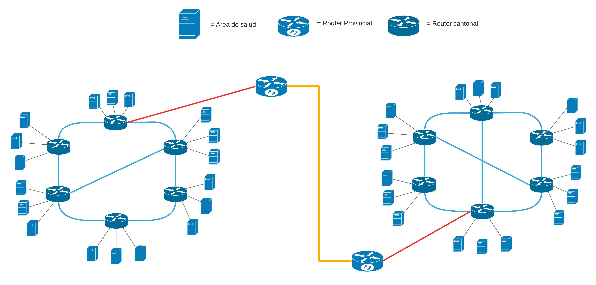
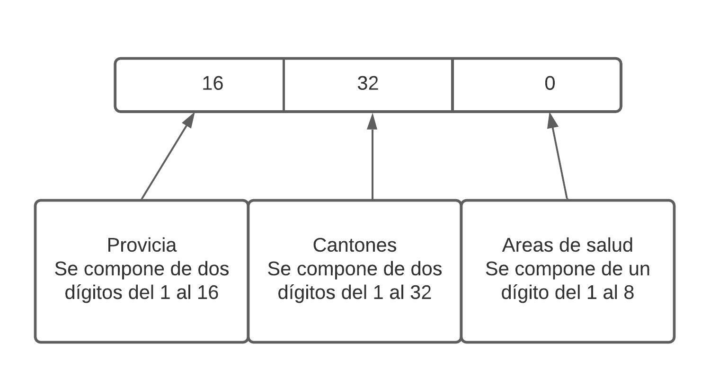
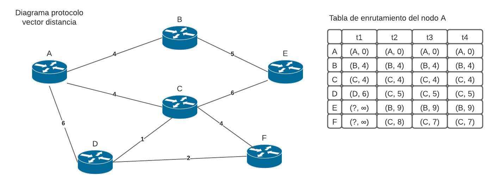
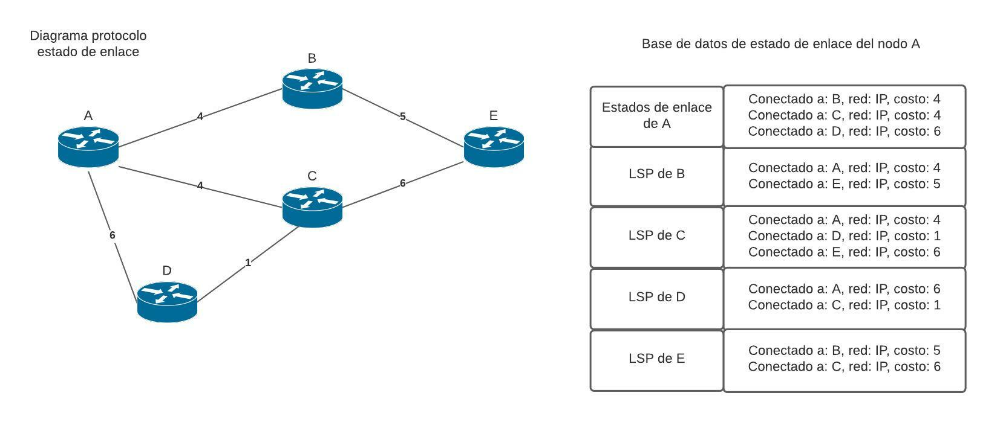
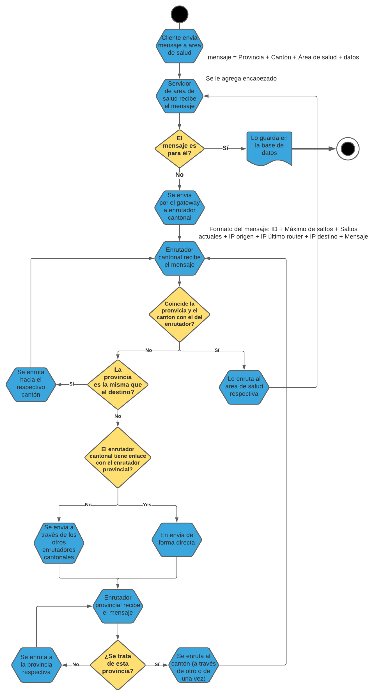

# CIA

## Integrantes
* Carlos Valle - B57388
* Emmanuel D. Solis - B97670
* Gilbert Marquez - B94560
* Javier Molina - B84981

## Diseño de redes, segunda etapa de PI.

### Panorama general del problema:
La red solicitada es una red que permita la interconexión de los distintos servidores sobre los cuáles está montado el sistema de vacunación digital, esta red es necesaria debido a los requerimientos del proyecto. Está red nos genera un desafío de conexión en el sentido de la cantidad de conexiónes que se deben hacer; estas:
* 16 Provincias
* 32 Cantones
* 8 Áreas de Salud

Esto nos dejaría con 4096 posibles conexiones, a raíz de esto debemos crear un sistema de enrutamiento que permita que estas conexiones se den de forma estable y que permitan el paso de información.

### Topología
Debido al gran tamaño de la red no es posible proyectar la topología a escala completa, por lo que se decidió abstraer la naturaleza de la red en un diagrama con dos provincias, seis cantones y tres áreas de salud por cantón.

Dado que la cantidad de saltos que deben darse para llegar del punto A --> B deben ser máximo 8, para lograr esto es necesario que los tipos de topologías sean de tipo **mixto**, a nivel provincial y cantonal serán de tipo malla(mesh) ya que de esta forma se puden tener caminos eficientes con un número de saltos menor a 8. A nivel de áreas de salud la topología se puede ver como una estrella, ya que todas las áreas de salud se conectan directamente con su router cantonal.

### Mapeo incial de la red

El mapeo de la red se realizará antes de abrir los servidores para recibir conexiones. Del enunciado se puede inferir que todas las areas de salud de un cantón deben tener una conexión directa; por lo tanto solo haría falta enviar un mensaje al servidor para que este pueda almecenar sus direcciones. En el caso de los routers cantonales se mapea utilizando el algoritmo de estado de enlace, el cual solo hace falta ejecutarlo al incio de la simulación, para finalizar los routers provinciales deben utilizar el algoritmo de vector distancia en cual si debe estar actualizando periodicamente sus tabl;as de enrutamiento.

### ¿En qué consiste la tabla de enrutamiento?

Una tabla de enrutamiento consiste en un espacio de memoria en el que se almacena toda la información necesaria para que los paquetes lleguen a su destino de la forma más óptima posible. Nuestros routers almacenarán su información en un sistema de memoria diseñado por nosotros mismos. 
La tabla de enrutamiento contará con los siguientes campos: 
* IP lógica (provincia,cantón, área de salud)
* Ruta 
* Peso 
* IP física
* Puerto

**¿Cuál es la función y el formato de las IP lógicas?**

La IP lógicas funcionan como identificadores para poder conectarse con distintos nodos de la red. Debido a que la red se encuentra conformada por 16 provincias, 32 cantones y 8 areas de salud por canton se llegó al concenso de utilizar cada uno de estos 3 elementos como las tres partes del IP de la siguiente manera: 

Cabe resaltar que en caso de que un campo se ponga en cero significa que ese campo no es necesario en el contexto actual, por ejemplo un router provincial solo requiere la provincia, no requiere el cantón o el área de salud.

### Formato de los mensajes
El formato fue decidido de manera grupal, según lo acordado fue que llevaría la estructura: 

| Componente                          | Formato                                                                              |
| ------------------------------------|--------------------------------------------------------------------------------------|
|**Encabezado**                       | ID, MáximosSaltos, SaltosActuales, origen, ultimoRouter, destino                     |
|**Tamaño de encabezado**             | 1 byte ID, 2 bytes MS, 1 byte SA, 5 bytes IPO, 5 bytes IPUR,5 bytes IPD              |  
|**Mensaje de confirmación**          | destino -> ip origen = encabezado+n                                                  |
|**Formato de tablas de enrutamiento**| Destino(ip lógica-5 bytes), ruta(ip lógica 5 bytes), costo total(4 bytes)            |
|**Envío de tablas de enrutamiento**  | Encabezado+string(Destino, ruta, costo total)                                        |

El porqué en la mayoría de mensajes se usa un solo byte es porque no serán tomados como el formato tradicional de int o short. Sino que se hara uso del formato ASCII, esta fue una decisión de caracter grupal sin embargo nuestro grupo podría hacer una implementación distinta a nivel interno sin afectar la intercomunicación con los otros equipos.

### Protocolo vector distancia (inter-provincial)
El protocolo vector distancia será utilizado para el enrutamiento de paquetes inter-provinciales. Este protocolo se encarga del enrutamiento de paquetes a través de los nodos que entre sí tengan menor peso. Es un enrutamiento dinámico, es decir, no se predeterminan rutas de manera estática; las decisiones de enrutamiento se toman en dependencia del estado de la red. Es distribuído, o sea, el nodo que posee el paquete es el que decide a donde reenviarlo; no hay un nodo central que predetermina las rutas. También es un algoritmo adyancente, debido a que cada nodo maneja información obtenida de sus nodos vecinos de red.

En el digrama anterior, se oberva una red que contiene los nodos A, B, C, D, E y F, con los respectivos pesos entre cada nodo; a su derecha se observa la tabla de enrutamiento para el nodo A. Las columnas t1, t2, t3 y t4 representan 4 actualizaciones en el mapeo de la red, mientras que las filas representan los diversos nodos. Observamos que la fila con el nodo A se mantiene igual a través del tiempo, ya que no es necesario que el nodo A se reenvíe un paquete a sí mismo.
Como podemos apreciar, en la primera iteración, el nodo A solo conoce los pesos de sus vecinos adyacentes y asume que la vía más rápida para llegar a estos es a través de su vínculo directo, dado que es el único camino que conoce en este momento. Para los nodos E y F no conoce cómo llegar, lo que se denota con "?" y no conoce el peso, el cual se asume infinito "∞".
Para la segunda iteración, ya el nodo A descubre cómo llegar al nodo E, por la vía A, B y E la cual tiene un ; también descubre el camino A, C y E pero este, al tener un peso de 10, es más costoso que el anterior, por ende no se toma en cuenta en la tabla de enrutamiento. En esta iteración, también descubre que es menos costoso llegar a D a través de C, así que reemplaza (D, 6) por (C, 5) en la tabla.
De esta manera, cada nodo obtiene información de la tabla de enrutamiento de cada uno de sus vecinos, esto le permite, luego de cierta cantidad de iteraciones, conocer el a que vecino reenviarle el paquete, para que llegue por la vía menos costosa.

### Protocolo estado de enlace (intra-provincial)
Este es el protocolo que se usara para enrutar entre provincias y cantones. El protocolo de estado de enlace funciona por medio de una comunicación con todos sus nodos, es decir que cuando hay un cambio este notificará a todos sus nodos de este cambio; este protocolo es más sencillo que el de vector distancia y también menos óptimo, la razón de utilizar este es porque es más sencillo de implementar, lo cuál es lo que se requiere en las conexiones entre las provincias y los cantones que se da por medio del router.

El protocolo de estado de enlace funciona de la siguiente forma:

Primero cada router debe conocer sus redes conectadas, de este modo, los routers intercambian un mensaje de saludo para conocer a los routers vecinos que sigan el mismo protocolo (estado de enlace).

Luego, cada router creará un paquete de estado de enlace (LSP), el cual, incluye la información de sus vecinos. Este paquete se propagará entre todos los routers, es decir, cada router enviará el paquete LSP a sus vecinos, estos vecinos reenviarán a sus vecinos y así sucesivamente. De esta forma, todos los routers tendrán la información de toda la red almacenada (enlaces, costo, etc).

Una vez que se ha obtenido toda esta información, los routers crearán un mapa topológico de la red para determinar las mejores rutas hacia un destino. Para ello se crea un árbol de mínimo costo utilizando el algoritmo de Dijkstra.

Todo este proceso (envíar información entre routers y crear el mapa topológico) se realizará solo cuando se inicia la red o cuando ocurre un cambio en la topología.

El siguiente gráfico muestra un ejemplo de una red y de la información que contendría el router "A" después de haberse propagado toda la información entre los routers. Todos los routers tendrán una base de datos parecida.

### Diagrama de funcionamiento general
El siguiente es un digrama de flujo representante del protocolo general de red. 

