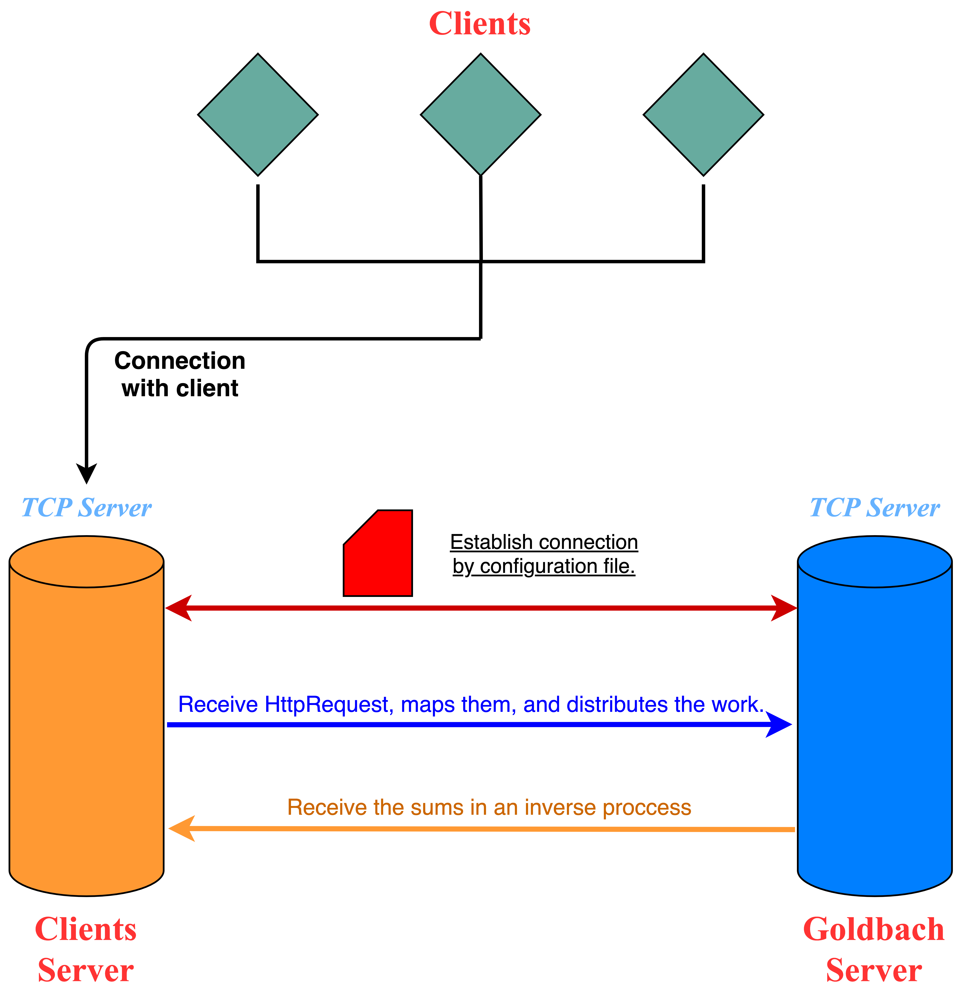

# Diseno

## Tabla de Contenidos
  - [Servidor Concurrente](#adv01)
  - [Aplicacion Web Concurrente](#adv02)
  - [Aplicacion Distribuida](#adv03)

## Servidor Concurrente
La distribucion del trabajo que se logro se ejemplifica por medio de la siguiente figura:

Los clientes recibidos se pondrian en una cola donde serian atendidos por diversos hilos del servidor, cada uno de estos hilos podia tener a su vez mas de solo un cliente, ademas contenian en si una instancia de la aplicacion web y por ende, siguiendo el flujo, de la calculadora. Este diseno presentaba un problema y es que ante la posible llegada de una gran cantidad de trabajo, los diversos hilos se iban a ver sobrecargados, tratando de explotar los recursos de procesamiento limitados de la computadora, esto resultaria al final en una distribucion no tan eficiente, es por ello que se realizara una mejora.

## Aplicacion Web Concurrente
Dado el problema planteado en el punto anterior era necesario algo que permitiera una mejor distribucion de los recursos, la propuesta es la siguiente:

Podemos ver que ahora existen otros procesos en paralelo que son las calculadoras, mejor conocidas como la aplicacion web, para tener una mejor distribucion podemos verla como una fila de cajeros de un banco donde todos tratan de atender a la misma velocidad y en el orden en que llegan, por eso la cola, sin embargo se implementa ademas la descomposicion de los numeros solicitados, es decir que si hay varios numeros que procesar estos no seran todos procesados por la misma aplicacion haciendo que esta dure mucho sino que cada una de las aplicaciones tomara numeros de la cola compartida que se tiene, haciendo que los trabajos pesados sean completados con mayor velocidad. Una vez que la linea de produccion tiene el producto listo (las sumas), uno de los trabajadores se encargara de mandar la respuesta al cliente que originalmente la solicito.

## Aplicacion Distribuida
Con el proposito de lograr un aun mejor desempeno y aprovechar los recursos que pueden estar disponibles en un sistema o cluster es que se plantea la nueva siguiente solucion:

La idea principal es tener dos servidores, por ende dos ejecutables, uno de ellos se encarga de procesar las sumas de la forma mas optima posible implementando paralelismo de datos y tecnicas de descomposicion y mapeo, mientras que el otro se encarga de atender a los clientes. Es facil de notar que esta solucion requiere mayor consumo de recursos pero reduce significativamente los tiempos de espera por medio de una comunicacion con un servidor exclusivamente dedicado a calcular sumas, lo cual es mas optimo que solo tener ambas cosas corriendo en el mismo proceso.